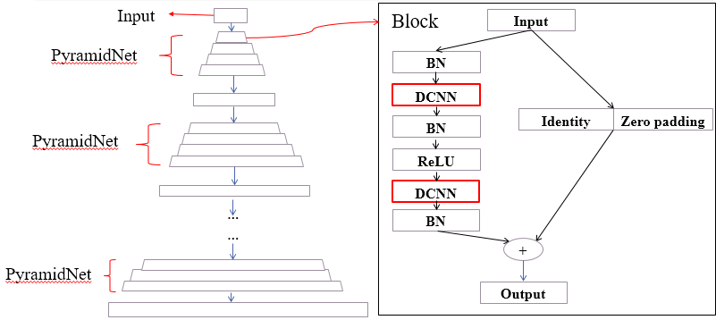
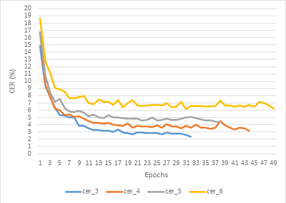
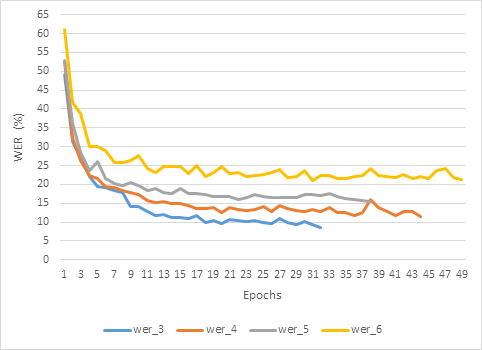
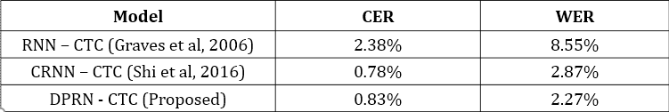
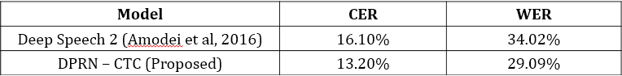

# Thesis

New recongintions from broadcast videos: Text recognition from images and audio of videos. 

First, we extracted features from video, then fed them to models. The output layer of model is connected with [CTC loss function](https://arxiv.org/abs/1511.07122) to evaluate their performance.

Beside models proposed by previous works, both recognition tasks are solved by using Dilated Pyramid Residual Network (our proposal). See more at [https://doi.org/10.32508/stdjns.v2i5.789](https://doi.org/10.32508/stdjns.v2i5.789)

## 1. Dataset preparation

### 1.1 Textbox extraction from frames of videos 

To extract textbox region from frames in video, checkout [https://github.com/anvy1102/text-region-extract](https://github.com/anvy1102/text-region-extract). After that, we manually typed labels for textbox extracted from images. 

### 1.2 Features of audios
With audio, we experienced with Log Mel Filter Bank and MFCC from libraries of python (python_speech_features and librosa).

### 1.3 Dataset size

Both of datasets are in Vietnamese, some words are English. 

We downloaded 276 videos from VTV News via youtube. We collected 5602 images of textbox and their conresponding labels. Images have 40 pixel in height and 300 to 450 pixel in width. Length of text is from 4 to 13 words and height of text is around 20 pixel. 

Speech dataset for training is provided by AILab of VNU-HCMUS, includes 39321 audios and scripts, around 88 hours. 

## 2. Dilated Pyramid Residual Network

The idea is adding [dilated convolution](https://arxiv.org/abs/1511.07122) block into [deep pyramidal residual network](https://arxiv.org/abs/1610.02915).

## 3. Text recognition

### 3.1 Text recognition from images with RNN-CTC (Baseline)

 

### 3.2 Text recognition from images with DPRN-CTC

### 3.3 Text recognition from images with DPRN-CTC

